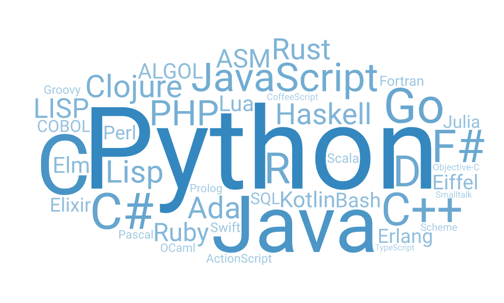
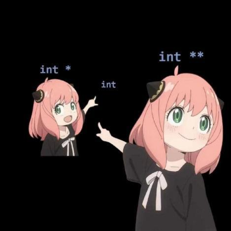

# Duy's User Page
[About Me](#about-me)

[My Favorite Programing Languages](#my-favorite-programing-languages)

[My Favorite Memes](#my-favorite-meme)

[My Top 5 Movies](#my-top-5-movies)

[My Goals](#current-goals)

[Todo List](#todo-list)


*[Source](https://www.vecteezy.com/vector-art/7559606-a-children-learning-coding-or-computer-programming-flat-illustration-coding-for-kids-basic-computer-programing-can-be-used-for-web-landing-page-social-media-promotion-etc)*

*[Source](https://igorfil.com/posts/2020-05-03-what-language-to-learn-next/cover.png)*

---

## About Me
---
Hi everyone, I am Duy, an UCSD senior studying Mathematics and Computer Science. I enjoy solving problems, building things from sratch, and applying textbook knowledge into applications. In my free time, I cook and play videos game with friends.

> My favorite games are League of Legends, Overcooked, and League of Legends

## My Favorite Programing Languages
---
- ***Python***

```
print("Hello World")
```
- ***Java***

```
class HelloWorld {
    public static void main(String[] args) {
        System.out.println("Hello, World!"); 
    }
}
```
- ***C++***

```
#include <iostream>

int main() {
    std::cout << "Hello World!";
    return 0;
}
```


## My Favorite Meme
---


*[Source: https://www.reddit.com/r/ProgrammerHumor/comments/vhf8rw/points/](https://www.reddit.com/r/ProgrammerHumor/comments/vhf8rw/points/)*

## My other Favorite Memes
---
[Meme 1](page.md)

[Meme 2](page.md)

## My Top 5 Movies
---
1. Breaking Bad
2. Avengers: End Game
3. Seven
4. The Social Network
5. The Wolf of Wall Street

## Current Goals
---
- Pass this class
- Become a software engineer

## Todo List
---

- [ ] Watch CSE 101 lectures
- [ ] Play games
- [x] Complete CSE 110 homework
- [ ] Complete CSE 167 homework

